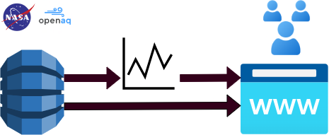

# Nasa-Space-App
### project presented for the Nasa Space Apps Challenge
Cloud2Action serves as a portal where users can easily get insights from the air quality in real time of their current location, or any other part in the world. The aim of the project is to raise awareness of the poor air conditions some locations experience by making the collected data of easy understanding and to avoid people from getting exposed to these conditions by alerting them.

The user accesses the web: https://cloud2action.health/ and can either choose its current location or an specific location. As well as the current date, our a past date. On the dashboard, the user sees a map with space information from TEMPO of its local area, more specifically levels for Nitrogen dioxide (NO2), Formaldehyde (CH2O or HCHO), Aerosol Index (AI), Particulate matter (PM), Ozone (O3), the parameters which bets define air quality.

In the dasboard, the user gets as well information about the air quality obtained from its closest ground station.  This informations is obtained from the Open AQ API.

As well, the user can get accurate predictions for the following 24 hours based on a time series model.

All this information is summarised in simple alerts, which help the user get clear insights about the overall air quality, taking advantage and combining the huge amounts of available date from satellite TEMPO and from ground stations.

The project is coded on Python and is deployed on Azure servers.

Our current version, available for the Los Angeles area can be tested at: https://cloud2action.health/

